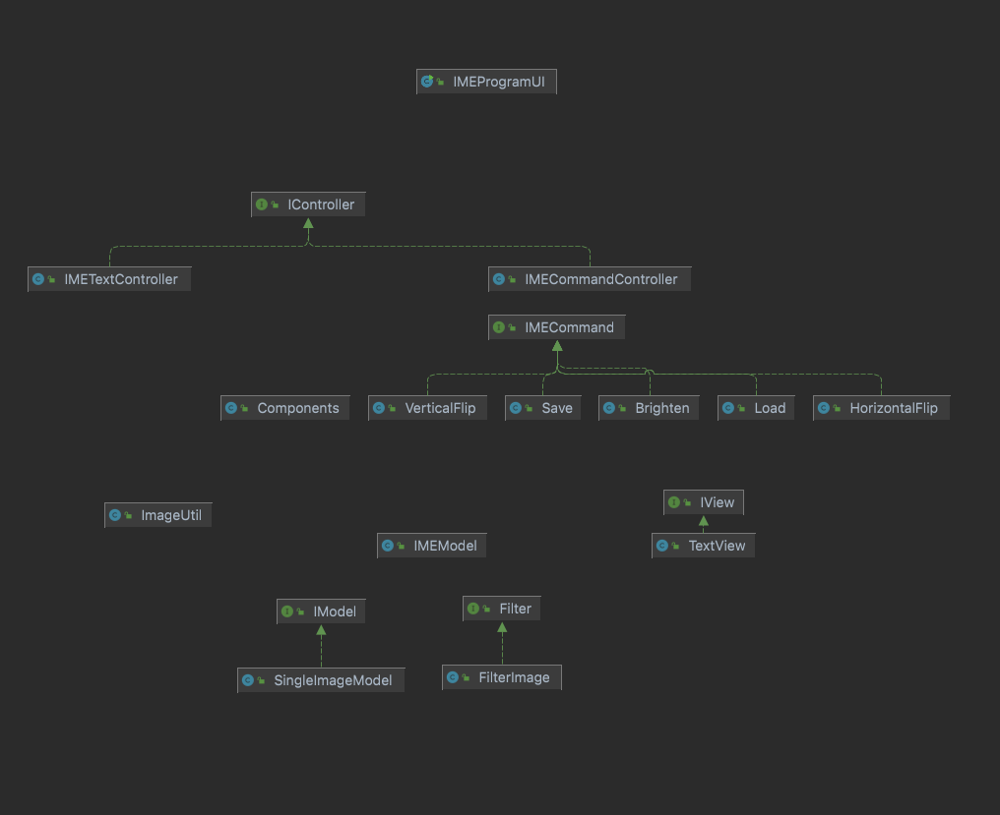

# Assignment 4: Image Processing (Part 1)

## CS3500: Object Oriented Design

### IME: Image Manipulation and Enhancement

This program is designed to represent an image processing environment capable of reading storing,
editing and saving .ppm photos.

### Scripts

To run a script from a .txt file please create a new program and enter the command ‘run [file-path]’
relative to project root. Included at res/testScript.txt is a basic script that can be used to test
a few functions program.

### Model

* **[Class] IMEModel**
    * Class to represent IME model, which holds a gallery of loaded images and edits made to them.
* **[Interface] IModel**
    * This interface represents a basic image model.
    * **[Class] SingleImageModel**
        * Implementation of IModel interface for ppm single image model.
* **[Interface] Filter**
    * Interface to represent various types of image with various types of filters that can be
      applied.
    * **[Class] FilterImage**
        * This class implements the Filter interface. It represents a class with the possible
          filters on an image such as grayscale, value, luma, and intensity component.
* **[Class] ImageUtil**
    * This class contains utility methods to read a PPM image from file return a 3D int
      representation of the file, and write an image into a PPM file.

### Controller

* **[Interface] IController**
    * Interface to represent a basic controller for IMEModel.
    * **[Class] IMETextController**
        * Text-based, command-design implementation of IController.

### View

* **IView [Interface]**
    * Interface for a basic IME view for IMEModel.
    * **[Class] TextView**
        * Implementation of IView to represent a basic, text based view for IMEModel.

### Class Diagram

Images used for testing:
[Venice](www.google.com)
[Koala](https://picryl.com/media/koala-3f3389)
These files are licensed under
the  [Creative Commons](https://en.wikipedia.org/wiki/en:Creative_Commons)   [Attribution-Share Alike 4.0 International](https://creativecommons.org/licenses/by-sa/4.0/deed.en)
license.
